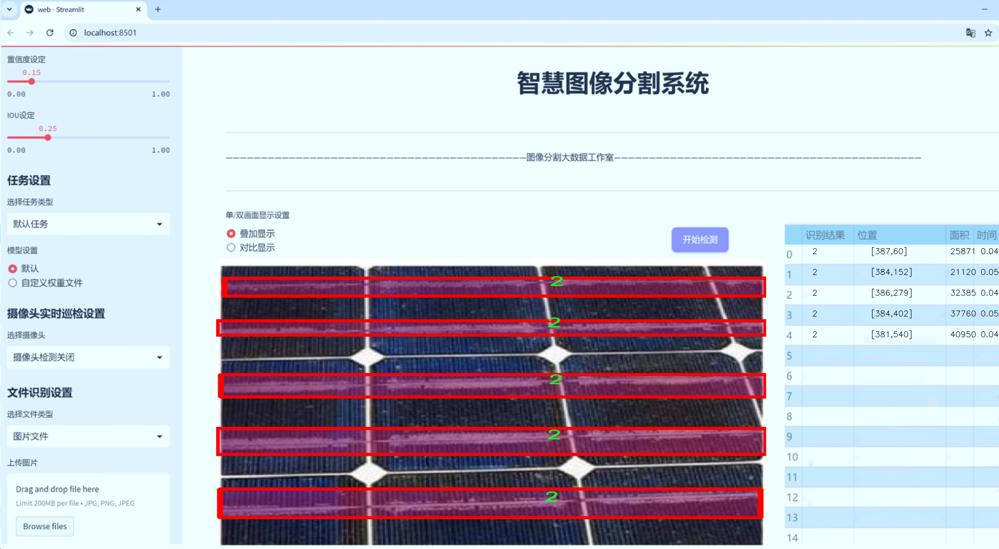
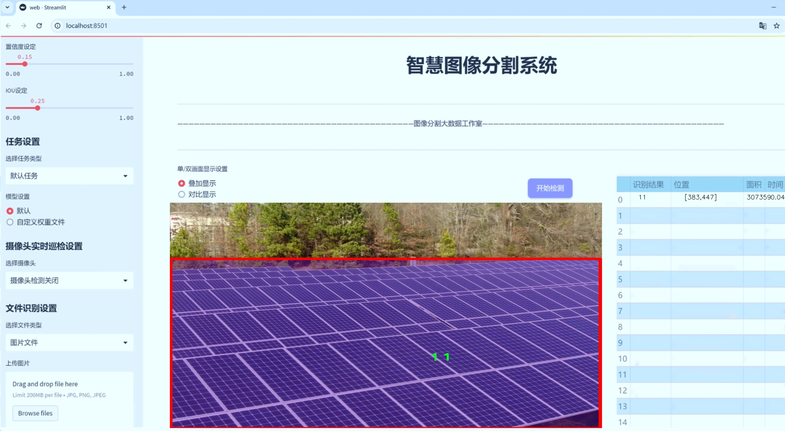
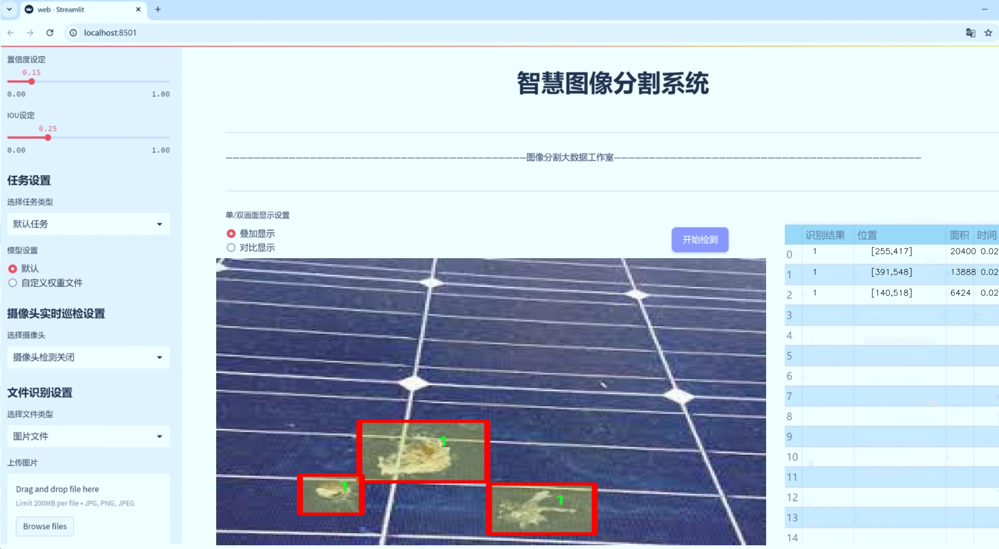
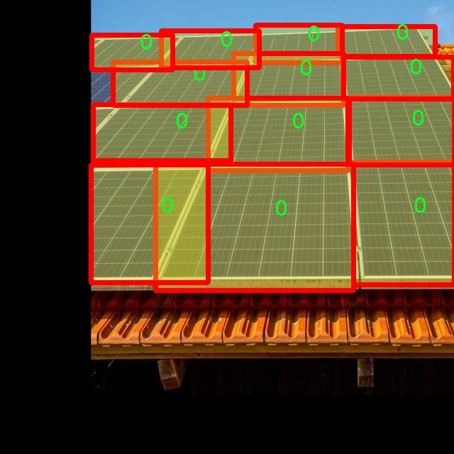
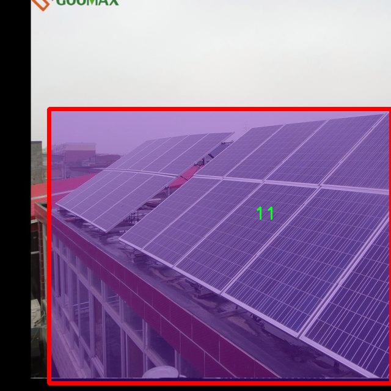
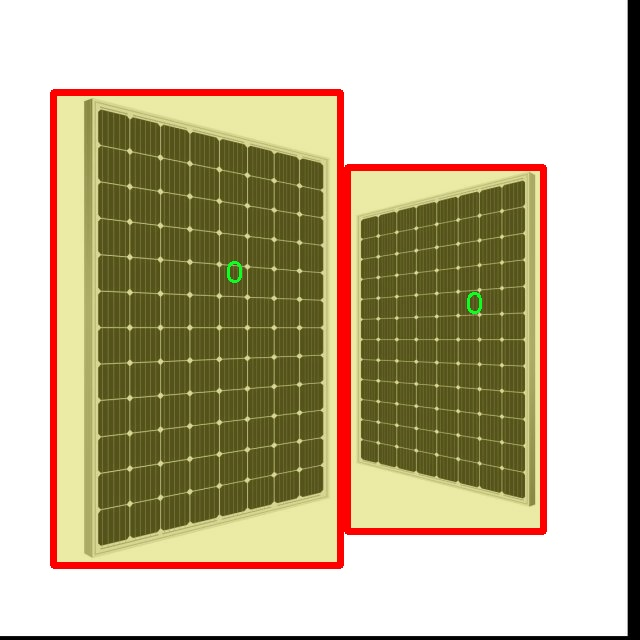
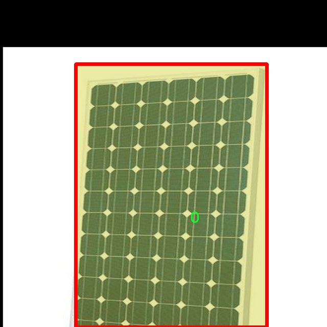
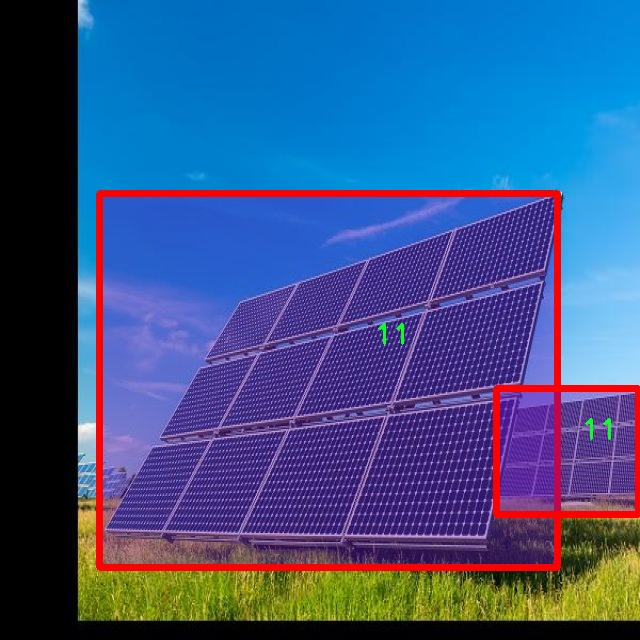

# 太阳能板表面缺陷裂缝等识别系统源码＆数据集分享
 [yolov8-seg-HGNetV2＆yolov8-seg-C2f-Faster等50+全套改进创新点发刊_一键训练教程_Web前端展示]

### 1.研究背景与意义

项目参考[ILSVRC ImageNet Large Scale Visual Recognition Challenge](https://gitee.com/YOLOv8_YOLOv11_Segmentation_Studio/projects)

项目来源[AAAI Global Al lnnovation Contest](https://kdocs.cn/l/cszuIiCKVNis)

研究背景与意义

随着全球对可再生能源的日益重视，太阳能作为一种清洁、可再生的能源形式，正逐渐成为各国能源结构转型的重要组成部分。太阳能板的使用量不断增加，然而，太阳能板在长期的使用过程中，难免会出现各种表面缺陷，如裂缝、污垢、划痕等。这些缺陷不仅影响太阳能板的光电转换效率，还可能导致设备的早期失效，进而影响整个太阳能发电系统的稳定性和经济性。因此，及时、准确地识别和评估太阳能板的表面缺陷，对于保障太阳能发电系统的高效运行和延长设备使用寿命具有重要的现实意义。

在传统的缺陷检测方法中，人工检测不仅耗时耗力，而且容易受到主观因素的影响，导致漏检和误检的情况频繁发生。随着计算机视觉和深度学习技术的快速发展，基于图像处理的自动化缺陷检测系统逐渐成为研究的热点。YOLO（You Only Look Once）系列模型以其快速、高效的目标检测能力，成为众多视觉任务中的首选算法。特别是YOLOv8作为该系列的最新版本，凭借其在精度和速度上的显著提升，为实时缺陷检测提供了新的可能性。

本研究旨在基于改进的YOLOv8模型，构建一个高效的太阳能板表面缺陷识别系统。我们将利用一个包含2400张图像的数据集，该数据集涵盖了13个类别的缺陷，提供了丰富的样本和多样化的缺陷类型。这些类别不仅包括常见的裂缝、污垢等缺陷，还涵盖了其他可能影响太阳能板性能的异常情况。通过对这些数据的深入分析和处理，我们希望能够提升模型在复杂环境下的检测能力，从而实现对太阳能板表面缺陷的高效识别。

本研究的意义不仅在于技术层面的创新，更在于其在实际应用中的广泛前景。通过建立一个准确、快速的缺陷识别系统，能够有效降低人工检测的成本，提高检测效率，为太阳能行业的智能化发展提供有力支持。此外，该系统的成功应用还将为其他领域的缺陷检测提供借鉴，推动相关技术的进一步发展。

综上所述，基于改进YOLOv8的太阳能板表面缺陷识别系统的研究，不仅具有重要的学术价值，也具备显著的社会和经济意义。通过推动太阳能板缺陷检测技术的进步，我们期待能够为可再生能源的可持续发展贡献一份力量，同时为实现全球能源结构的转型与升级提供技术支持。

### 2.图片演示







##### 注意：由于此博客编辑较早，上面“2.图片演示”和“3.视频演示”展示的系统图片或者视频可能为老版本，新版本在老版本的基础上升级如下：（实际效果以升级的新版本为准）

  （1）适配了YOLOV8的“目标检测”模型和“实例分割”模型，通过加载相应的权重（.pt）文件即可自适应加载模型。

  （2）支持“图片识别”、“视频识别”、“摄像头实时识别”三种识别模式。

  （3）支持“图片识别”、“视频识别”、“摄像头实时识别”三种识别结果保存导出，解决手动导出（容易卡顿出现爆内存）存在的问题，识别完自动保存结果并导出到tempDir中。

  （4）支持Web前端系统中的标题、背景图等自定义修改，后面提供修改教程。

  另外本项目提供训练的数据集和训练教程,暂不提供权重文件（best.pt）,需要您按照教程进行训练后实现图片演示和Web前端界面演示的效果。

### 3.视频演示

[3.1 视频演示](https://www.bilibili.com/video/BV1bSSeYGE8y/)

### 4.数据集信息展示

##### 4.1 本项目数据集详细数据（类别数＆类别名）

nc: 13
names: ['0', '1', '10', '11', '12', '2', '3', '4', '5', '6', '7', '8', '9']


##### 4.2 本项目数据集信息介绍

数据集信息展示

在本研究中，我们采用了名为“segmore”的数据集，以训练和改进YOLOv8-seg模型，旨在提升太阳能板表面缺陷，尤其是裂缝等问题的识别能力。该数据集包含13个类别，具体类别标识为数字，从‘0’到‘12’。这些类别的划分不仅有助于细化缺陷的分类，还为模型提供了丰富的训练样本，使其能够在实际应用中更为精准地识别和定位不同类型的缺陷。

“segmore”数据集的设计初衷是为了应对太阳能板在生产和使用过程中可能出现的各种表面缺陷。随着可再生能源的快速发展，太阳能板的使用日益普及，而其表面缺陷的检测则成为保障太阳能板效率和寿命的重要环节。通过对这些缺陷进行有效识别，可以及时采取维护措施，避免因小问题导致的重大损失。因此，构建一个高效、准确的缺陷识别系统显得尤为重要。

在数据集的构建过程中，研究团队精心挑选了多种类型的缺陷样本，包括但不限于裂缝、气泡、污垢等。每个类别的样本数量经过精确统计，以确保模型在训练过程中能够获得均衡的学习机会，避免因某一类别样本过多而导致的偏差。此外，数据集中的样本均经过专业标注，确保每个缺陷的边界和特征都得到了准确的描述，这为后续的模型训练提供了坚实的基础。

数据集的多样性和丰富性使得YOLOv8-seg模型在学习过程中能够捕捉到不同缺陷的特征，进而提高其在实际应用中的泛化能力。通过对“segmore”数据集的训练，模型不仅能够识别出裂缝等明显的缺陷，还能够处理一些微小的、难以察觉的表面问题。这一特性在实际应用中具有重要意义，因为许多缺陷在早期阶段可能并不明显，但如果不及时处理，可能会导致更严重的后果。

在数据集的使用过程中，我们还注重数据的预处理和增强，以进一步提升模型的性能。通过图像旋转、缩放、裁剪等方式，我们为模型提供了更多的训练样本变体，使其能够在不同的环境和条件下保持高效的识别能力。此外，数据集的标注信息也为后续的模型评估提供了依据，使得我们能够通过对比分析，了解模型在不同类别上的表现，进而进行针对性的优化。

总之，“segmore”数据集的构建和应用为太阳能板表面缺陷的检测提供了强有力的支持。通过与YOLOv8-seg模型的结合，我们期望能够实现高效、准确的缺陷识别，为太阳能产业的健康发展贡献一份力量。未来，我们将继续对数据集进行扩展和优化，以应对不断变化的市场需求和技术挑战。











### 5.全套项目环境部署视频教程（零基础手把手教学）

[5.1 环境部署教程链接（零基础手把手教学）](https://www.bilibili.com/video/BV1jG4Ve4E9t/?vd_source=bc9aec86d164b67a7004b996143742dc)


[5.2 安装Python虚拟环境创建和依赖库安装视频教程链接（零基础手把手教学）](https://www.bilibili.com/video/BV1nA4VeYEze/?vd_source=bc9aec86d164b67a7004b996143742dc)

### 6.手把手YOLOV8-seg训练视频教程（零基础小白有手就能学会）

[6.1 手把手YOLOV8-seg训练视频教程（零基础小白有手就能学会）](https://www.bilibili.com/video/BV1cA4VeYETe/?vd_source=bc9aec86d164b67a7004b996143742dc)


按照上面的训练视频教程链接加载项目提供的数据集，运行train.py即可开始训练



     Epoch   gpu_mem       box       obj       cls    labels  img_size
     1/200     0G   0.01576   0.01955  0.007536        22      1280: 100%|██████████| 849/849 [14:42<00:00,  1.04s/it]
               Class     Images     Labels          P          R     mAP@.5 mAP@.5:.95: 100%|██████████| 213/213 [01:14<00:00,  2.87it/s]
                 all       3395      17314      0.994      0.957      0.0957      0.0843

     Epoch   gpu_mem       box       obj       cls    labels  img_size
     2/200     0G   0.01578   0.01923  0.007006        22      1280: 100%|██████████| 849/849 [14:44<00:00,  1.04s/it]
               Class     Images     Labels          P          R     mAP@.5 mAP@.5:.95: 100%|██████████| 213/213 [01:12<00:00,  2.95it/s]
                 all       3395      17314      0.996      0.956      0.0957      0.0845

     Epoch   gpu_mem       box       obj       cls    labels  img_size
     3/200     0G   0.01561    0.0191  0.006895        27      1280: 100%|██████████| 849/849 [10:56<00:00,  1.29it/s]
               Class     Images     Labels          P          R     mAP@.5 mAP@.5:.95: 100%|███████   | 187/213 [00:52<00:00,  4.04it/s]
                 all       3395      17314      0.996      0.957      0.0957      0.0845


### 7.50+种全套YOLOV8-seg创新点代码加载调参视频教程（一键加载写好的改进模型的配置文件）

[7.1 50+种全套YOLOV8-seg创新点代码加载调参视频教程（一键加载写好的改进模型的配置文件）](https://www.bilibili.com/video/BV1Hw4VePEXv/?vd_source=bc9aec86d164b67a7004b996143742dc)

### 8.YOLOV8-seg图像分割算法原理

原始YOLOv8-seg算法原理

YOLOv8-seg算法是YOLO系列中的最新版本，结合了目标检测与图像分割的能力，旨在实现更高效、更准确的视觉任务处理。YOLO（You Only Look Once）作为一种经典的一阶段目标检测算法，最初通过将目标检测任务转化为回归问题，利用单一神经网络模型同时预测目标的位置和类别，开创了目标检测的新纪元。随着YOLO系列的不断演进，YOLOv8在前几代的基础上进行了多项创新，特别是在网络结构、特征提取和损失函数设计等方面，极大地提升了模型的性能和灵活性。

YOLOv8的网络结构由主干网络（backbone）、特征增强网络（neck）和检测头（head）三部分组成。主干网络采用了CSP（Cross Stage Partial）设计理念，以提高特征提取的效率和准确性。特征增强网络则引入了PAN-FPN（Path Aggregation Network - Feature Pyramid Network）的思想，通过多尺度特征融合，进一步提升了模型对不同尺度目标的处理能力。在检测头部分，YOLOv8采用了解耦头（Decoupled Head），将分类和回归任务分为两个独立的分支，使得每个任务能够更加专注于自身的特征提取，从而有效解决了复杂场景下的定位不准和分类错误的问题。

与以往的YOLO版本相比，YOLOv8的一个显著特点是采用了Anchor-free目标检测方法。这种方法的核心在于不再依赖预先定义的锚框，而是直接通过回归的方式预测目标的位置和大小。这一创新使得模型在处理不同尺度和形状的目标时更加灵活，避免了传统锚框方法中繁琐的锚框选择和调整过程。通过这种方式，YOLOv8能够更快地聚焦于目标位置的邻近点，使得预测框更接近于实际边界框区域，从而提高了检测精度。

在输入处理方面，YOLOv8采用了自适应图片缩放技术，以提高目标检测和推理的速度。具体而言，模型在测试或推理时会将图像的长边按比例缩小到指定尺寸，然后对短边进行填充，以尽量减少信息冗余。这种处理方式在保证图像信息完整性的同时，显著提升了模型的实时性。此外，YOLOv8在训练过程中引入了Mosaic数据增强操作，通过随机将四张图像进行缩放和拼接，生成新的训练样本，进一步增强了模型的鲁棒性和泛化能力。

在主干网络中，YOLOv8将C3模块替换为C2F模块，后者通过引入更多的跳层连接，丰富了梯度流信息，同时保持了模型的轻量化。这一设计使得YOLOv8在特征提取时能够获得更高的精度和更合理的延迟。在特征增强网络中，YOLOv8对Neck部分进行了优化，去除了多余的卷积连接层，直接对不同阶段输出的特征进行上采样，从而提高了特征融合的效率。

YOLOv8的检测头部分则是其结构变化最大的地方。通过引入解耦头，YOLOv8将分类和定位任务分开处理，使得模型在进行目标检测时能够更好地适应不同的任务需求。具体而言，分类任务更关注特征图中提取到的特征与已有类别的相似度，而定位任务则专注于边界框与真实框的位置关系。这样的设计不仅提高了模型的收敛速度，还显著提升了预测的精度。

在损失函数的设计上，YOLOv8也进行了创新。传统的目标检测模型在训练和推理过程中可能存在逻辑不一致性，YOLOv8通过取消Obj分支，简化了损失函数的设计。在分类分支中，依然采用二值交叉熵损失（BCELoss），而在边界框回归分支中，则引入了分布焦点损失（DFL）和CIoU损失，以加速模型对标签附近数值的聚焦。这种设计不仅提高了模型的训练效率，还使得模型在实际应用中表现出更好的性能。

综上所述，YOLOv8-seg算法通过一系列创新的设计和改进，不仅在目标检测任务中取得了显著的性能提升，还在图像分割领域展现出了强大的能力。其轻量化的模型结构、灵活的Anchor-free方法、有效的特征融合和精确的损失函数设计，使得YOLOv8成为实时检测和图像分割任务的理想选择。随着YOLOv8的广泛应用，其在各类视觉任务中的表现将不断被验证和提升，为计算机视觉领域的发展带来新的机遇和挑战。


### 9.系统功能展示（检测对象为举例，实际内容以本项目数据集为准）

图9.1.系统支持检测结果表格显示

  图9.2.系统支持置信度和IOU阈值手动调节

  图9.3.系统支持自定义加载权重文件best.pt(需要你通过步骤5中训练获得)

  图9.4.系统支持摄像头实时识别

  图9.5.系统支持图片识别

  图9.6.系统支持视频识别

  图9.7.系统支持识别结果文件自动保存

  图9.8.系统支持Excel导出检测结果数据


### 10.50+种全套YOLOV8-seg创新点原理讲解（非科班也可以轻松写刊发刊，V11版本正在科研待更新）

#### 10.1 由于篇幅限制，每个创新点的具体原理讲解就不一一展开，具体见下列网址中的创新点对应子项目的技术原理博客网址【Blog】：


[10.1 50+种全套YOLOV8-seg创新点原理讲解链接](https://gitee.com/qunmasj/good)

#### 10.2 部分改进模块原理讲解(完整的改进原理见上图和技术博客链接)【如果此小节的图加载失败可以通过CSDN或者Github搜索该博客的标题访问原始博客，原始博客图片显示正常】

### YOLOv8简介
#### YOLOv8是什么？
YOLOv8是Ultralytics公司推出的基于对象检测模型的YOLO最新系列，它能够提供截至目前最先进的对象检测性能。

借助于以前的YOLO模型版本支持技术，YOLOv8模型运行得更快、更准确，同时为执行任务的训练模型提供了统一的框架，这包括：

目标检测
实例分割
图像分类
在撰写本文时，Ultralytics的YOLOv8存储库中其实还有很多功能有待添加，这包括训练模型的整套导出功能等。此外，Ultralytics将计划在Arxiv上发布一篇相关的论文，将对YOLOv8与其他最先进的视觉模型进行比较。

#### YOLOv8的新功能
Ultralytics为YOLO模型发布了一个全新的存储库（https://github.com/ultralytics/ultralytics）。该存储库被构建为用于训练对象检测、实例分割和图像分类模型的统一框架。

以下列举的是这个新版本的一些关键功能：

用户友好的API（命令行+Python）。
更快、更准确。
支持：
目标检测，
实例分割和
图像分类。
可扩展到所有以前的版本。
新的骨干网络。
新的Anchor-Free head对象检测算法。
新的损失函数。
此外，YOLOv8也非常高效和灵活，它可以支持多种导出格式，而且该模型可以在CPU和GPU上运行。

#### YOLOv8中提供的子模型


YOLOv8模型的每个类别中共有五个模型，以便共同完成检测、分割和分类任务。其中，YOLOv8 Nano是最快和最小的模型，而YOLOv8Extra Large（YOLOv8x）是其中最准确但最慢的模型。

YOLOv8这次发行中共附带了以下预训练模型：

在图像分辨率为640的COCO检测数据集上训练的对象检测检查点。
在图像分辨率为640的COCO分割数据集上训练的实例分割检查点。
在图像分辨率为224的ImageNet数据集上预处理的图像分类模型。
### 高效网络架构 CloAtt简介
众所周知，自从 ViTs 提出后，Transformer 基本横扫各大 CV 主流任务，包括视觉识别、目标检测和语义分割等。然而，一个比较棘手的问题就是这个架构参数量和计算量太大，所以一直被广受诟病。因此，后续有不少工作都是朝着这个方向去改进，例如 Swin-Transformer 在局部非重叠窗口中进行注意力计算，而 PVT 中则是使用平均池化来合并 token 以进一步压缩耗时。然而，这些 ViTs 由于其参数量太大以及高 FLOPs 并不适合部署到移动设备。如果我们直接缩小到适合移动设备的尺寸时，它们的性能又会显著降低。


#### MobileViT
因此，出现了不少工作聚焦于探索轻量级的视觉变换器，使 ViTs 适用于移动设备，CVHub 此前也介绍过不少的工作，大家有兴趣可以翻阅历史文章读读。例如，苹果团队提出的 MobileViT 研究了如何将 CNN 与 Transformer 相结合，而另一个工作 MobileFormer 则将轻量级的 MobileNet 与 Transformer 进行融合。此外，最新提出的 EdgeViT 提出了一个局部-全局-局部模块来聚合信息。以上工作的目标都是设计具有高性能、较少参数和低 FLOPs 的移动端友好型模型。


#### EdgeViT
然而，作者从频域编码的角度认为，在现有的轻量级模型中，大多数方法只关注设计稀疏注意力，以有效地处理低频全局信息，而使用相对简单的方法处理高频局部信息。具体而言，大多数模型如 EdgeViT 和 MobileViT，只是简单使用原始卷积提取局部表示，这些方法仅使用卷积中的全局共享权重处理高频本地信息。其他方法，如 LVT ，则是首先将标记展开到窗口中，然后使用窗口内的注意力获得高频信息。这些方法仅使用特定于每个 Token 的上下文感知权重进行局部感知。


#### LVT
虽然上述轻量级模型在多个数据集上取得了良好的结果，但没有一种方法尝试设计更有效的方法，即利用共享和上下文感知权重的优势来处理高频局部信息。基于共享权重的方法，如传统的卷积神经网络，具有平移等变性的特征。与它们不同，基于上下文感知权重的方法，如 LVT 和 NAT，具有可以随输入内容变化的权重。这两种类型的权重在局部感知中都有自己的优势。
#### NAT


受该博客的启发，本文设计了一种轻量级视觉变换器——CloAtt，其利用了上下文感知的局部增强。特别地，CloAtt 采用了双分支设计结构。
#### 局部分支
在局部分支中，本文引入了一个精心设计的 AttnConv，一种简单而有效的卷积操作符，它采用了注意力机制的风格。所提出的 AttnConv 有效地融合了共享权重和上下文感知权重，以聚合高频的局部信息。具体地，AttnConv 首先使用深度卷积（DWconv）提取局部表示，其中 DWconv 具有共享权重。然后，其使用上下文感知权重来增强局部特征。与 Non-Local 等生成上下文感知权重的方法不同，AttnConv 使用门控机制生成上下文感知权重，引入了比常用的注意力机制更强的非线性。此外，AttnConv 将卷积算子应用于 Query 和 Key 以聚合局部信息，然后计算 Q 和 K 的哈达玛积，并对结果进行一系列线性或非线性变换，生成范围在 [-1,1] 之间的上下文感知权重。值得注意的是，AttnConv 继承了卷积的平移等变性，因为它的所有操作都基于卷积。
#### 全局分支
在全局分支中则使用了传统的注意力机制，但对 K 和 V 进行了下采样以减少计算量，从而捕捉低频全局信息。最后，CloFormer 通过简单的方法将局部分支和全局分支的输出进行融合，从而使模型能够同时捕捉高频和低频信息。总的来说，CloFormer 的设计能够同时发挥共享权重和上下文感知权重的优势，提高其局部感知的能力，使其在图像分类、物体检测和语义分割等多个视觉任务上均取得了优异的性能。
如上图2所示，CloFormer 共包含一个卷积主干和四个 stage，每个 stage you Clo 模块 和 ConvFFN 组合而成的模块堆叠而成 。具体得，首先将输入图像通过卷积主干传递，以获取 token 表示。该主干由四个卷积组成，每个卷积的步长依次为2、2、1和1。接下来，tokens 经历四个 Clo 块和 ConvFFN 阶段，以提取分层特征。最后，再利用全局平均池化和全连接层生成预测结果。可以看出，整个架构非常简洁，支持即插即用！


#### ConvFFN
为了将局部信息融入 FFN 过程中，本文采用 ConvFFN 替换了常用的 FFN。ConvFFN 和常用的 FFN 的主要区别在于，ConvFFN 在 GELU 激活函数之后使用了深度卷积（DWconv），从而使 ConvFFN 能够聚合局部信息。由于DWconv 的存在，可以直接在 ConvFFN 中进行下采样而不需要引入 PatchMerge 模块。CloFormer 使用了两种ConvFFN。第一种是在阶段内的 ConvFFN，它直接利用跳跃连接。另一种是连接两个阶段的 ConvFFN，主要用于下采样操作。
#### Clo block
CloFormer 中的 Clo块 是非常关键的组件。每个 Clo 块由一个局部分支和一个全局分支组成。在全局分支中，我们首先下采样 K 和 V，然后对 Q、K 和 V 进行标准的 attention 操作，以提取低频全局信息。
虽然全局分支的设计能够有效减少注意力机制所需的浮点运算次数，并且能够获得全局的感受野。然而，它在处理高频局部信息方面的能力不足。为了解决这个问题，CloFormer 引入了局部分支，并使用 AttnConv 对高频局部信息进行处理。AttnConv 可以融合共享权重和上下文感知权重，能够更好地处理高频局部信息。因此，CloFormer 结合了全局和局部的优势来提高图像分类性能。下面我们重点讲下 AttnConv 。
#### AttnConv
AttnConv 是一个关键模块，使得所提模型能够获得高性能。它结合了一些标准的 attention 操作。具体而言，在AttnConv 中，我们首先进行线性变换以获得 Q、K和V。在进行线性变换之后，我们再对 V 进行共享权重的局部特征聚合。然后，基于处理后的 V 和 Q ，K 进行上下文感知的局部增强。具体流程可对照流程图理解，我们可以将其拆解成三个步骤。
#### Local Feature Aggregation
为了简单起见，本文直接使用一个简单的深度卷积（DWconv）来对 V 进行局部信息聚合。
#### Context-aware Local Enhancement
在将具有共享权重的局部信息整合到 V 中后，我们结合 Q 和 K 生成上下文感知权重。值得注意的是，我们使用了与局部自注意力不同的方法，该方法更加简洁。具体而言，我们首先使用两个 DWconv 对 Q 和 K 分别进行局部信息聚合。然后，我们计算 Q 和 K 的 Hadamard 乘积，并对结果进行一系列转换，以获取在 -1 到 1 之间的上下文感知权重。最后，我们使用生成的权重来增强局部特征。
#### Fusion with Global Branch
在整个 CloFormer 中，我们使用一种简单直接的方法来将局部分支和全局分支的输出进行融合。具体而言，本文是通过将这两个输出在通道维度上进行直接拼接，然后再通过一个 FC 层聚合这些特征并结合残差输出。
最后，上图展示了三种不同的方法。相比于传统卷积，AttnConv 中的上下文感知权重使得模型能够更好地适应输入内容。相比于局部自注意力机制，引入共享权重使得模型能够更好地处理高频信息，从而提高性能。此外，生成上下文感知权重的方法引入了更强的非线性性，也提高了性能。需要注意的是，AttnConv 中的所有操作都基于卷积，保持了卷积的平移等变性特性。


### 11.项目核心源码讲解（再也不用担心看不懂代码逻辑）

#### 11.1 ultralytics\nn\backbone\CSwomTramsformer.py

以下是经过精简和注释的 CSWin Transformer 代码，保留了最核心的部分：

```python
import torch
import torch.nn as nn
import numpy as np

class Mlp(nn.Module):
    """多层感知机（MLP）模块"""
    def __init__(self, in_features, hidden_features=None, out_features=None, act_layer=nn.GELU, drop=0.):
        super().__init__()
        out_features = out_features or in_features  # 输出特征数
        hidden_features = hidden_features or in_features  # 隐藏层特征数
        self.fc1 = nn.Linear(in_features, hidden_features)  # 第一层线性变换
        self.act = act_layer()  # 激活函数
        self.fc2 = nn.Linear(hidden_features, out_features)  # 第二层线性变换
        self.drop = nn.Dropout(drop)  # Dropout层

    def forward(self, x):
        """前向传播"""
        x = self.fc1(x)
        x = self.act(x)
        x = self.drop(x)
        x = self.fc2(x)
        x = self.drop(x)
        return x

class LePEAttention(nn.Module):
    """带位置编码的注意力机制"""
    def __init__(self, dim, resolution, num_heads, split_size=7, attn_drop=0.):
        super().__init__()
        self.dim = dim  # 输入特征维度
        self.resolution = resolution  # 输入分辨率
        self.split_size = split_size  # 分块大小
        self.num_heads = num_heads  # 注意力头数
        head_dim = dim // num_heads  # 每个头的维度
        self.scale = head_dim ** -0.5  # 缩放因子
        self.get_v = nn.Conv2d(dim, dim, kernel_size=3, stride=1, padding=1, groups=dim)  # 卷积用于获取值

    def im2cswin(self, x):
        """将输入转换为窗口形式"""
        B, N, C = x.shape
        H = W = int(np.sqrt(N))  # 计算高度和宽度
        x = x.transpose(-2, -1).contiguous().view(B, C, H, W)  # 转换形状
        # 这里省略了窗口划分的具体实现
        return x

    def forward(self, qkv):
        """前向传播"""
        q, k, v = qkv  # 分别获取查询、键、值
        q = self.im2cswin(q)  # 将查询转换为窗口形式
        k = self.im2cswin(k)  # 将键转换为窗口形式
        # 省略了注意力计算的具体实现
        return v  # 返回值

class CSWinBlock(nn.Module):
    """CSWin Transformer的基本块"""
    def __init__(self, dim, num_heads, split_size=7, mlp_ratio=4.):
        super().__init__()
        self.qkv = nn.Linear(dim, dim * 3)  # 查询、键、值的线性变换
        self.attn = LePEAttention(dim, resolution=split_size, num_heads=num_heads)  # 注意力层
        self.mlp = Mlp(in_features=dim, hidden_features=int(dim * mlp_ratio))  # MLP层

    def forward(self, x):
        """前向传播"""
        qkv = self.qkv(x).reshape(-1, 3, x.size(-1))  # 计算qkv
        attn_output = self.attn(qkv)  # 计算注意力输出
        x = x + attn_output  # 残差连接
        x = x + self.mlp(x)  # 通过MLP层
        return x

class CSWinTransformer(nn.Module):
    """CSWin Transformer模型"""
    def __init__(self, img_size=640, num_classes=1000, embed_dim=96, depth=[2, 2, 6, 2], num_heads=[2, 4, 8, 16]):
        super().__init__()
        self.embed_dim = embed_dim
        self.stage1 = nn.ModuleList([CSWinBlock(embed_dim, num_heads[0]) for _ in range(depth[0])])  # 第一阶段
        self.stage2 = nn.ModuleList([CSWinBlock(embed_dim * 2, num_heads[1]) for _ in range(depth[1])])  # 第二阶段
        # 省略了后续阶段的实现

    def forward(self, x):
        """前向传播"""
        for blk in self.stage1:
            x = blk(x)  # 通过第一阶段的块
        for blk in self.stage2:
            x = blk(x)  # 通过第二阶段的块
        return x

# 模型实例化与测试
if __name__ == '__main__':
    inputs = torch.randn((1, 3, 640, 640))  # 输入数据
    model = CSWinTransformer()  # 创建模型实例
    res = model(inputs)  # 前向传播
    print(res.size())  # 输出结果的尺寸
```

### 代码说明：
1. **Mlp 类**：实现了一个简单的多层感知机，包含两层线性变换和激活函数。
2. **LePEAttention 类**：实现了带位置编码的注意力机制，包含将输入转换为窗口形式的功能。
3. **CSWinBlock 类**：构成 CSWin Transformer 的基本模块，包含查询、键、值的线性变换和注意力计算。
4. **CSWinTransformer 类**：整体模型，包含多个 CSWinBlock 以处理输入数据。

### 省略的部分：
- 注意力计算的具体实现细节。
- 后续阶段的实现细节（如第三阶段和第四阶段）。
- 窗口划分和重组的具体实现。

以上代码提供了 CSWin Transformer 的核心结构和功能，适合进行进一步的研究和开发。

这个文件实现了CSWin Transformer模型，这是一个用于计算机视觉任务的深度学习模型，特别是在图像分类等任务中表现出色。文件中包含了多个类和函数，每个部分都有其特定的功能。

首先，文件引入了必要的库，包括PyTorch及其神经网络模块、一些用于图像处理的库以及一些工具函数。接着，定义了几个重要的类。`Mlp`类实现了一个多层感知机（MLP），包含两个线性层和一个激活函数（默认为GELU），用于对输入进行变换和特征提取。

`LePEAttention`类实现了一种新的注意力机制，称为局部增强位置编码（LePE）。这个类通过将输入图像分割成窗口并计算注意力来处理图像数据。它的`forward`方法接收查询、键和值（qkv），并计算注意力权重，然后将这些权重应用于值上，以获得加权输出。

`CSWinBlock`类则是CSWin Transformer的基本构建块，包含了注意力层和MLP层。它通过规范化层和残差连接来增强模型的学习能力。这个类的构造函数中根据输入的分辨率和其他参数初始化了注意力层和MLP层。

接下来，`img2windows`和`windows2img`函数用于将图像数据从图像格式转换为窗口格式，反之亦然。这是CSWin Transformer中处理图像数据的关键步骤。

`Merge_Block`类用于在不同阶段之间合并特征图，它通过卷积层来减少特征图的分辨率，同时保持特征信息。

`CSWinTransformer`类是整个模型的核心，它定义了模型的结构，包括多个阶段，每个阶段由多个`CSWinBlock`组成。模型的输入经过卷积嵌入层，然后依次通过各个阶段的块进行处理。每个阶段的输出通过合并块进行处理，以便将特征图的分辨率减小并增加通道数。

在模型的初始化过程中，定义了模型的超参数，如图像大小、嵌入维度、深度、头数等。模型的权重初始化也在这里进行。

文件的最后部分定义了一些函数，用于创建不同规模的CSWin Transformer模型（如CSWin_tiny、CSWin_small等），并提供了加载预训练权重的功能。主函数部分则演示了如何创建这些模型并对随机输入进行前向传播，输出每个模型的特征图大小。

总的来说，这个文件实现了一个复杂的视觉变换器模型，采用了创新的注意力机制和特征处理方法，旨在提高图像处理任务的性能。

#### 11.2 ultralytics\utils\loss.py

以下是代码中最核心的部分，并附上详细的中文注释：

```python
import torch
import torch.nn as nn
import torch.nn.functional as F

class BboxLoss(nn.Module):
    def __init__(self, reg_max, use_dfl=False):
        """初始化BboxLoss模块，设置最大正则化值和DFL选项。"""
        super().__init__()
        self.reg_max = reg_max  # 最大正则化值
        self.use_dfl = use_dfl  # 是否使用分布焦点损失
        self.nwd_loss = False  # 是否使用NWD损失
        self.iou_ratio = 0.5  # IoU损失的比例

    def forward(self, pred_dist, pred_bboxes, anchor_points, target_bboxes, target_scores, target_scores_sum, fg_mask):
        """计算IoU损失和（可选的）DFL损失。"""
        weight = target_scores.sum(-1)[fg_mask].unsqueeze(-1)  # 计算权重
        iou = bbox_iou(pred_bboxes[fg_mask], target_bboxes[fg_mask], xywh=False, CIoU=True)  # 计算IoU
        loss_iou = ((1.0 - iou) * weight).sum() / target_scores_sum  # IoU损失

        # DFL损失
        if self.use_dfl:
            target_ltrb = bbox2dist(anchor_points, target_bboxes, self.reg_max)  # 将目标框转换为分布
            loss_dfl = self._df_loss(pred_dist[fg_mask].view(-1, self.reg_max + 1), target_ltrb[fg_mask]) * weight  # 计算DFL损失
            loss_dfl = loss_dfl.sum() / target_scores_sum  # 归一化DFL损失
        else:
            loss_dfl = torch.tensor(0.0).to(pred_dist.device)  # 如果不使用DFL，损失为0

        return loss_iou, loss_dfl  # 返回IoU损失和DFL损失

    @staticmethod
    def _df_loss(pred_dist, target):
        """计算分布焦点损失（DFL）。"""
        tl = target.long()  # 目标左边界
        tr = tl + 1  # 目标右边界
        wl = tr - target  # 左边权重
        wr = 1 - wl  # 右边权重
        return (F.cross_entropy(pred_dist, tl.view(-1), reduction='none').view(tl.shape) * wl +
                F.cross_entropy(pred_dist, tr.view(-1), reduction='none').view(tl.shape) * wr).mean(-1, keepdim=True)  # 返回DFL损失

class v8DetectionLoss:
    """计算检测任务的损失类。"""

    def __init__(self, model):
        """初始化v8DetectionLoss，设置模型相关属性和BCE损失函数。"""
        device = next(model.parameters()).device  # 获取模型设备
        h = model.args  # 超参数

        m = model.model[-1]  # Detect()模块
        self.bce = nn.BCEWithLogitsLoss(reduction='none')  # 初始化BCE损失
        self.hyp = h  # 超参数
        self.stride = m.stride  # 模型步幅
        self.nc = m.nc  # 类别数量
        self.reg_max = m.reg_max  # 最大正则化值
        self.device = device  # 设备

        self.bbox_loss = BboxLoss(m.reg_max - 1).to(device)  # 初始化边界框损失

    def __call__(self, preds, batch):
        """计算损失并返回。"""
        loss, batch_size = self.compute_loss(preds, batch)  # 计算损失
        return loss.sum() * batch_size, loss.detach()  # 返回总损失和分离的损失

    def compute_loss(self, preds, batch):
        """计算边界框、类别和DFL的损失总和。"""
        loss = torch.zeros(3, device=self.device)  # 初始化损失（边界框、类别、DFL）
        pred_distri, pred_scores = preds  # 获取预测的分布和分数

        # 目标处理
        targets = torch.cat((batch['batch_idx'].view(-1, 1), batch['cls'].view(-1, 1), batch['bboxes']), 1)  # 连接目标
        gt_labels, gt_bboxes = targets.split((1, 4), 2)  # 分割目标标签和边界框

        # 计算边界框损失
        pred_bboxes = self.bbox_decode(pred_distri)  # 解码预测的边界框
        loss[0], loss[2] = self.bbox_loss(pred_distri, pred_bboxes, gt_bboxes)  # 计算边界框损失和DFL损失

        # 计算类别损失
        loss[1] = self.bce(pred_scores, gt_labels)  # 计算类别损失

        return loss  # 返回损失

    def bbox_decode(self, pred_dist):
        """解码预测的边界框坐标。"""
        # 这里的解码逻辑可以根据具体需求实现
        return pred_dist  # 返回解码后的边界框
```

### 代码核心部分说明：
1. **BboxLoss类**：负责计算边界框的损失，包括IoU损失和可选的分布焦点损失（DFL）。
   - `forward`方法计算IoU损失和DFL损失。
   - `_df_loss`方法计算DFL损失。

2. **v8DetectionLoss类**：负责计算整个检测模型的损失。
   - `__init__`方法初始化损失计算所需的参数和模型。
   - `__call__`方法计算损失并返回。
   - `compute_loss`方法计算边界框损失和类别损失。
   - `bbox_decode`方法用于解码预测的边界框坐标。

这些部分是YOLO模型中损失计算的核心逻辑，能够有效地评估模型的性能并指导训练过程。

这个文件包含了多个用于计算损失的类，主要用于目标检测、分割和关键点检测等任务。以下是对代码的逐步解析。

首先，文件导入了必要的库，包括PyTorch的核心库和一些自定义的工具函数和指标计算方法。然后定义了多个损失类，每个类实现了特定的损失计算逻辑。

`SlideLoss`类是一个损失模块，它通过调整损失的权重来增强训练过程。它的构造函数接收一个损失函数，并将其减小到每个元素的计算。`forward`方法根据预测值和真实值计算损失，并根据`auto_iou`的值调整损失的权重。

`EMASlideLoss`类与`SlideLoss`类似，但它使用指数移动平均来平滑`auto_iou`的计算，能够在训练过程中动态调整损失的权重。

`VarifocalLoss`类实现了一种新的损失函数，专门用于处理目标检测中的不平衡问题。它通过计算加权的二元交叉熵损失来实现。

`FocalLoss`类是对已有损失函数的封装，主要用于处理类别不平衡的问题。它通过引入调制因子来增强对难分类样本的关注。

`BboxLoss`类负责计算边界框的损失。它支持不同的损失计算方法，包括IoU损失和分布焦点损失（DFL）。在`forward`方法中，它计算预测边界框与目标边界框之间的IoU，并根据需要计算DFL损失。

`KeypointLoss`类用于计算关键点的损失。它根据预测的关键点和真实的关键点之间的欧几里得距离来计算损失，并考虑了关键点的可见性。

`v8DetectionLoss`类是一个综合性的损失计算类，负责计算目标检测任务中的各种损失，包括边界框损失、分类损失和DFL损失。它在初始化时设置了一些模型相关的参数，并定义了损失计算的流程。

`v8SegmentationLoss`和`v8PoseLoss`类是针对分割和姿态估计任务的损失计算类，分别扩展了`v8DetectionLoss`类，增加了特定于这些任务的损失计算逻辑。

最后，`v8ClassificationLoss`类实现了简单的分类损失计算，使用交叉熵损失来评估预测结果与真实标签之间的差异。

整体而言，这个文件提供了一系列灵活的损失计算模块，能够支持多种深度学习任务，尤其是在目标检测和相关领域。每个损失类都实现了自己的逻辑，以便在训练过程中优化模型的性能。

#### 11.3 ultralytics\utils\tuner.py

以下是代码中最核心的部分，并附上详细的中文注释：

```python
def run_ray_tune(model,
                 space: dict = None,
                 grace_period: int = 10,
                 gpu_per_trial: int = None,
                 max_samples: int = 10,
                 **train_args):
    """
    使用 Ray Tune 进行超参数调优。

    参数:
        model (YOLO): 要进行调优的模型。
        space (dict, optional): 超参数搜索空间。默认为 None。
        grace_period (int, optional): ASHA 调度器的宽限期（以 epochs 为单位）。默认为 10。
        gpu_per_trial (int, optional): 每个试验分配的 GPU 数量。默认为 None。
        max_samples (int, optional): 运行的最大试验次数。默认为 10。
        train_args (dict, optional): 传递给 `train()` 方法的额外参数。默认为 {}。

    返回:
        (dict): 包含超参数搜索结果的字典。
    """

    # 记录信息，提示用户了解 Ray Tune 的文档
    LOGGER.info('💡 Learn about RayTune at https://docs.ultralytics.com/integrations/ray-tune')
    
    # 如果没有提供 train_args，则初始化为空字典
    if train_args is None:
        train_args = {}

    # 尝试安装 Ray Tune
    try:
        subprocess.run('pip install ray[tune]'.split(), check=True)

        import ray
        from ray import tune
        from ray.air import RunConfig
        from ray.air.integrations.wandb import WandbLoggerCallback
        from ray.tune.schedulers import ASHAScheduler
    except ImportError:
        raise ModuleNotFoundError('调优超参数需要 Ray Tune。请使用: pip install "ray[tune]" 安装')

    # 尝试导入 wandb（用于实验记录）
    try:
        import wandb
        assert hasattr(wandb, '__version__')
    except (ImportError, AssertionError):
        wandb = False  # 如果导入失败，则将 wandb 设置为 False

    # 定义默认的超参数搜索空间
    default_space = {
        'lr0': tune.uniform(1e-5, 1e-1),  # 初始学习率
        'lrf': tune.uniform(0.01, 1.0),  # 最终学习率的比例
        'momentum': tune.uniform(0.6, 0.98),  # 动量
        'weight_decay': tune.uniform(0.0, 0.001),  # 权重衰减
        'warmup_epochs': tune.uniform(0.0, 5.0),  # 预热 epochs
        # 其他超参数...
    }

    # 将模型放入 Ray 存储中
    task = model.task
    model_in_store = ray.put(model)

    def _tune(config):
        """
        使用指定的超参数和额外参数训练 YOLO 模型。

        参数:
            config (dict): 用于训练的超参数字典。

        返回:
            None.
        """
        model_to_train = ray.get(model_in_store)  # 从 Ray 存储中获取模型
        model_to_train.reset_callbacks()  # 重置回调
        config.update(train_args)  # 更新超参数配置
        results = model_to_train.train(**config)  # 训练模型
        return results.results_dict  # 返回结果字典

    # 获取搜索空间，如果没有提供，则使用默认搜索空间
    if not space:
        space = default_space
        LOGGER.warning('WARNING ⚠️ search space not provided, using default search space.')

    # 获取数据集
    data = train_args.get('data', TASK2DATA[task])
    space['data'] = data  # 将数据集添加到搜索空间
    if 'data' not in train_args:
        LOGGER.warning(f'WARNING ⚠️ data not provided, using default "data={data}".')

    # 定义可训练的函数并分配资源
    trainable_with_resources = tune.with_resources(_tune, {'cpu': NUM_THREADS, 'gpu': gpu_per_trial or 0})

    # 定义 ASHA 调度器进行超参数搜索
    asha_scheduler = ASHAScheduler(time_attr='epoch',
                                   metric=TASK2METRIC[task],
                                   mode='max',
                                   max_t=train_args.get('epochs') or DEFAULT_CFG_DICT['epochs'] or 100,
                                   grace_period=grace_period,
                                   reduction_factor=3)

    # 定义超参数搜索的回调
    tuner_callbacks = [WandbLoggerCallback(project='YOLOv8-tune')] if wandb else []

    # 创建 Ray Tune 超参数搜索调优器
    tune_dir = get_save_dir(DEFAULT_CFG, name='tune').resolve()  # 获取保存目录
    tune_dir.mkdir(parents=True, exist_ok=True)  # 创建目录
    tuner = tune.Tuner(trainable_with_resources,
                       param_space=space,
                       tune_config=tune.TuneConfig(scheduler=asha_scheduler, num_samples=max_samples),
                       run_config=RunConfig(callbacks=tuner_callbacks, storage_path=tune_dir))

    # 运行超参数搜索
    tuner.fit()

    # 返回超参数搜索的结果
    return tuner.get_results()
```

### 代码说明
1. **函数定义**：`run_ray_tune` 函数用于执行超参数调优，接受模型、超参数空间、宽限期、每个试验的 GPU 数量、最大样本数和其他训练参数。
2. **日志记录**：使用 `LOGGER` 记录信息，帮助用户了解如何使用 Ray Tune。
3. **安装依赖**：尝试安装 Ray Tune，如果安装失败则抛出异常。
4. **超参数空间**：定义了一个默认的超参数搜索空间，包含学习率、动量等多个参数。
5. **模型存储**：将模型放入 Ray 的存储中，以便在调优过程中使用。
6. **训练函数**：`_tune` 函数负责根据给定的超参数配置训练模型，并返回训练结果。
7. **搜索空间和数据集**：检查是否提供了搜索空间和数据集，如果没有则使用默认值。
8. **调度器和回调**：定义 ASHA 调度器和可选的 Wandb 回调，用于记录实验。
9. **创建调优器**：使用 Ray Tune 创建调优器并运行超参数搜索，最后返回结果。

这个程序文件 `ultralytics/utils/tuner.py` 主要用于实现超参数调优，特别是针对 YOLO 模型的训练。它使用了 Ray Tune 库来进行超参数的搜索和优化。以下是对代码的详细讲解。

首先，文件引入了一些必要的模块，包括 `subprocess` 用于执行系统命令，以及从 `ultralytics` 包中导入的一些配置和工具函数。`run_ray_tune` 函数是该文件的核心，负责执行超参数调优的主要逻辑。

该函数的参数包括模型对象、超参数搜索空间、ASHA 调度器的宽限期、每个试验分配的 GPU 数量、最大样本数以及其他训练参数。函数首先记录一条信息，提示用户了解 Ray Tune 的文档。

接下来，函数尝试安装 Ray Tune 库，如果未安装则抛出异常。随后，导入 Ray 及其相关模块，包括调度器和日志记录器。还尝试导入 `wandb` 库，用于记录实验结果。如果未能导入 `wandb`，则将其设置为 `False`。

接着，定义了一个默认的超参数搜索空间，包含了学习率、动量、权重衰减、数据增强等多个参数的范围。这些参数将用于模型训练时的超参数调优。

函数中定义了一个内部函数 `_tune`，该函数接收一个超参数配置字典，使用这些超参数训练 YOLO 模型，并返回训练结果。模型会从 Ray 存储中获取，并重置回调函数。

在获取搜索空间后，如果用户未提供自定义的搜索空间，则使用默认的搜索空间，并记录警告信息。同时，从训练参数中获取数据集的信息，如果未提供数据集，也会记录警告。

接下来，定义了一个可训练的函数 `trainable_with_resources`，并指定了 CPU 和 GPU 的资源分配。然后，设置 ASHA 调度器，定义超参数搜索的策略，包括最大训练轮数和宽限期等。

如果 `wandb` 可用，定义相应的回调函数以记录实验。然后，创建一个 Ray Tune 的超参数搜索调优器，并指定参数空间、调度器和回调函数等。

最后，调用 `tuner.fit()` 开始超参数搜索，并返回搜索结果。这些结果将包含每个试验的超参数和对应的性能指标，供后续分析和选择最佳超参数配置。

总的来说，这个文件实现了一个灵活的超参数调优框架，利用 Ray Tune 的强大功能，能够高效地搜索 YOLO 模型的最佳超参数配置。

#### 11.4 ultralytics\nn\modules\conv.py

以下是经过简化并添加详细中文注释的核心代码部分：

```python
import torch
import torch.nn as nn

def autopad(k, p=None, d=1):  # kernel, padding, dilation
    """自动计算填充以保持输出形状不变。"""
    if d > 1:
        k = d * (k - 1) + 1 if isinstance(k, int) else [d * (x - 1) + 1 for x in k]  # 实际的卷积核大小
    if p is None:
        p = k // 2 if isinstance(k, int) else [x // 2 for x in k]  # 自动填充
    return p

class Conv(nn.Module):
    """标准卷积层，包含卷积、批归一化和激活函数。"""
    default_act = nn.SiLU()  # 默认激活函数

    def __init__(self, c1, c2, k=1, s=1, p=None, g=1, d=1, act=True):
        """初始化卷积层，参数包括输入通道数、输出通道数、卷积核大小、步幅、填充、分组、扩张和激活函数。"""
        super().__init__()
        self.conv = nn.Conv2d(c1, c2, k, s, autopad(k, p, d), groups=g, dilation=d, bias=False)  # 卷积层
        self.bn = nn.BatchNorm2d(c2)  # 批归一化层
        self.act = self.default_act if act is True else act if isinstance(act, nn.Module) else nn.Identity()  # 激活函数

    def forward(self, x):
        """前向传播：应用卷积、批归一化和激活函数。"""
        return self.act(self.bn(self.conv(x)))

class DWConv(Conv):
    """深度可分离卷积层，使用标准卷积类进行初始化。"""

    def __init__(self, c1, c2, k=1, s=1, d=1, act=True):
        """初始化深度可分离卷积层，参数包括输入通道数、输出通道数、卷积核大小、步幅、扩张和激活函数。"""
        super().__init__(c1, c2, k, s, g=math.gcd(c1, c2), d=d, act=act)  # 分组卷积

class ConvTranspose(nn.Module):
    """转置卷积层。"""
    default_act = nn.SiLU()  # 默认激活函数

    def __init__(self, c1, c2, k=2, s=2, p=0, bn=True, act=True):
        """初始化转置卷积层，参数包括输入通道数、输出通道数、卷积核大小、步幅、填充、是否使用批归一化和激活函数。"""
        super().__init__()
        self.conv_transpose = nn.ConvTranspose2d(c1, c2, k, s, p, bias=not bn)  # 转置卷积层
        self.bn = nn.BatchNorm2d(c2) if bn else nn.Identity()  # 批归一化层
        self.act = self.default_act if act is True else act if isinstance(act, nn.Module) else nn.Identity()  # 激活函数

    def forward(self, x):
        """前向传播：应用转置卷积、批归一化和激活函数。"""
        return self.act(self.bn(self.conv_transpose(x)))

class ChannelAttention(nn.Module):
    """通道注意力模块。"""

    def __init__(self, channels: int) -> None:
        """初始化通道注意力模块，设置基本配置和实例变量。"""
        super().__init__()
        self.pool = nn.AdaptiveAvgPool2d(1)  # 自适应平均池化
        self.fc = nn.Conv2d(channels, channels, 1, 1, 0, bias=True)  # 1x1卷积
        self.act = nn.Sigmoid()  # Sigmoid激活函数

    def forward(self, x: torch.Tensor) -> torch.Tensor:
        """前向传播：通过池化和卷积计算通道注意力，并应用于输入。"""
        return x * self.act(self.fc(self.pool(x)))

class SpatialAttention(nn.Module):
    """空间注意力模块。"""

    def __init__(self, kernel_size=7):
        """初始化空间注意力模块，设置卷积核大小。"""
        super().__init__()
        assert kernel_size in (3, 7), '卷积核大小必须为3或7'
        padding = 3 if kernel_size == 7 else 1
        self.cv1 = nn.Conv2d(2, 1, kernel_size, padding=padding, bias=False)  # 卷积层
        self.act = nn.Sigmoid()  # Sigmoid激活函数

    def forward(self, x):
        """前向传播：计算空间注意力并应用于输入。"""
        return x * self.act(self.cv1(torch.cat([torch.mean(x, 1, keepdim=True), torch.max(x, 1, keepdim=True)[0]], 1)))

class CBAM(nn.Module):
    """卷积块注意力模块。"""

    def __init__(self, c1, kernel_size=7):
        """初始化CBAM模块，设置输入通道和卷积核大小。"""
        super().__init__()
        self.channel_attention = ChannelAttention(c1)  # 通道注意力
        self.spatial_attention = SpatialAttention(kernel_size)  # 空间注意力

    def forward(self, x):
        """前向传播：依次应用通道注意力和空间注意力。"""
        return self.spatial_attention(self.channel_attention(x))
```

### 代码核心部分说明：
1. **自动填充函数 (`autopad`)**：用于计算卷积操作中所需的填充，以确保输出的空间维度与输入相同。
2. **卷积类 (`Conv`)**：实现了标准卷积操作，包含卷积、批归一化和激活函数的组合。
3. **深度可分离卷积类 (`DWConv`)**：继承自 `Conv` 类，专门用于实现深度可分离卷积。
4. **转置卷积类 (`ConvTranspose`)**：实现了转置卷积操作，常用于上采样。
5. **通道注意力模块 (`ChannelAttention`)**：通过对输入进行池化和卷积，计算通道注意力，并将其应用于输入。
6. **空间注意力模块 (`SpatialAttention`)**：通过对输入的空间特征进行处理，计算空间注意力，并将其应用于输入。
7. **CBAM模块 (`CBAM`)**：结合通道注意力和空间注意力的模块，增强特征表示能力。

这个程序文件 `ultralytics/nn/modules/conv.py` 定义了一系列用于卷积操作的模块，主要用于深度学习中的图像处理任务，特别是在 YOLO（You Only Look Once）目标检测模型中。文件中包含多个类，每个类实现了不同类型的卷积操作，下面是对主要部分的说明。

首先，文件导入了必要的库，包括 `torch` 和 `torch.nn`，并定义了一个 `autopad` 函数，用于根据卷积核的大小和扩张率自动计算填充量，以确保输出形状与输入形状相同。

接下来，定义了多个卷积类：

1. **Conv** 类实现了标准的卷积操作，包含卷积层、批归一化层和激活函数。构造函数接受多个参数，如输入通道数、输出通道数、卷积核大小、步幅、填充、分组和扩张等。`forward` 方法执行卷积、批归一化和激活函数的组合操作。

2. **Conv2** 类是对 `Conv` 类的扩展，增加了一个 1x1 的卷积层，用于并行处理。它的 `forward` 方法将两个卷积的输出相加。

3. **LightConv** 类实现了一种轻量级卷积结构，首先通过 1x1 卷积进行特征提取，然后通过深度卷积（`DWConv`）进一步处理。

4. **DWConv** 类实现了深度卷积，适用于通道数较大的情况，减少了参数量和计算量。

5. **ConvTranspose** 类实现了转置卷积操作，通常用于上采样。

6. **Focus** 类用于将输入的空间信息集中到通道维度，通过对输入进行下采样并拼接不同位置的特征图。

7. **GhostConv** 类实现了 Ghost 卷积，旨在通过生成额外的特征图来提高模型的表现。

8. **RepConv** 类是一个基本的重复卷积模块，支持训练和推理阶段的不同操作。它通过融合多个卷积层的权重来优化模型的推理速度。

此外，文件中还定义了注意力机制的模块，包括 **ChannelAttention** 和 **SpatialAttention**，用于在特征图中强调重要的通道和空间信息。**CBAM** 类结合了这两种注意力机制，以增强特征表示。

最后，**Concat** 类用于在指定维度上连接多个张量，通常用于在网络中合并不同层的特征。

整体来看，这个文件实现了多种卷积和注意力机制的模块，提供了灵活的构建块，以便在深度学习模型中使用，尤其是在目标检测和图像处理任务中。

#### 11.5 ultralytics\nn\tasks.py

以下是代码中最核心的部分，并附上详细的中文注释：

```python
import torch
import torch.nn as nn

class BaseModel(nn.Module):
    """BaseModel类是Ultralytics YOLO系列模型的基类。"""

    def forward(self, x, *args, **kwargs):
        """
        模型的前向传播，处理单个尺度的输入。
        
        参数:
            x (torch.Tensor | dict): 输入图像张量或包含图像张量和真实标签的字典。
        
        返回:
            (torch.Tensor): 网络的输出。
        """
        if isinstance(x, dict):  # 处理训练和验证时的情况
            return self.loss(x, *args, **kwargs)  # 计算损失
        return self.predict(x, *args, **kwargs)  # 进行预测

    def predict(self, x, profile=False, visualize=False, augment=False):
        """
        通过网络执行前向传播。
        
        参数:
            x (torch.Tensor): 输入张量。
            profile (bool): 如果为True，打印每层的计算时间，默认为False。
            visualize (bool): 如果为True，保存模型的特征图，默认为False。
            augment (bool): 在预测时进行图像增强，默认为False。
        
        返回:
            (torch.Tensor): 模型的最后输出。
        """
        if augment:
            return self._predict_augment(x)  # 进行增强预测
        return self._predict_once(x, profile, visualize)  # 单次预测

    def _predict_once(self, x, profile=False, visualize=False):
        """
        执行一次前向传播。
        
        参数:
            x (torch.Tensor): 输入张量。
            profile (bool): 如果为True，打印每层的计算时间，默认为False。
            visualize (bool): 如果为True，保存模型的特征图，默认为False。
        
        返回:
            (torch.Tensor): 模型的最后输出。
        """
        y, dt = [], []  # 输出列表和时间列表
        for m in self.model:  # 遍历模型中的每一层
            if m.f != -1:  # 如果不是来自前一层
                x = y[m.f] if isinstance(m.f, int) else [x if j == -1 else y[j] for j in m.f]  # 从早期层获取输入
            if profile:
                self._profile_one_layer(m, x, dt)  # 记录每层的计算时间
            x = m(x)  # 执行前向传播
            y.append(x if m.i in self.save else None)  # 保存输出
            if visualize:
                feature_visualization(x, m.type, m.i, save_dir=visualize)  # 可视化特征图
        return x  # 返回最后的输出

    def loss(self, batch, preds=None):
        """
        计算损失。
        
        参数:
            batch (dict): 用于计算损失的批次数据。
            preds (torch.Tensor | List[torch.Tensor]): 预测结果。
        """
        if not hasattr(self, 'criterion'):
            self.criterion = self.init_criterion()  # 初始化损失函数

        preds = self.forward(batch['img']) if preds is None else preds  # 获取预测结果
        return self.criterion(preds, batch)  # 计算损失

    def init_criterion(self):
        """初始化BaseModel的损失标准。"""
        raise NotImplementedError('compute_loss() needs to be implemented by task heads')  # 抛出未实现异常


class DetectionModel(BaseModel):
    """YOLOv8检测模型。"""

    def __init__(self, cfg='yolov8n.yaml', ch=3, nc=None, verbose=True):
        """使用给定的配置和参数初始化YOLOv8检测模型。"""
        super().__init__()  # 调用父类构造函数
        self.yaml = cfg if isinstance(cfg, dict) else yaml_model_load(cfg)  # 加载配置字典

        # 定义模型
        ch = self.yaml['ch'] = self.yaml.get('ch', ch)  # 输入通道
        if nc and nc != self.yaml['nc']:
            self.yaml['nc'] = nc  # 覆盖YAML中的类别数
        self.model, self.save = parse_model(deepcopy(self.yaml), ch=ch, verbose=verbose)  # 解析模型
        self.names = {i: f'{i}' for i in range(self.yaml['nc'])}  # 默认名称字典

        # 初始化权重和偏置
        initialize_weights(self)

    def init_criterion(self):
        """初始化DetectionModel的损失标准。"""
        return v8DetectionLoss(self)  # 返回YOLOv8检测损失
```

### 代码核心部分说明
1. **BaseModel类**: 这是所有YOLO模型的基类，定义了模型的基本结构和功能，包括前向传播、损失计算等。
2. **forward方法**: 处理输入数据，决定是进行预测还是计算损失。
3. **predict方法**: 执行模型的前向传播，支持多种选项如性能分析和可视化。
4. **loss方法**: 计算模型的损失，使用指定的损失标准。
5. **DetectionModel类**: 继承自BaseModel，专门用于YOLOv8的检测任务，初始化模型和损失标准。

这些部分是实现YOLO模型的核心，负责处理输入、执行推理和计算损失。

这个程序文件是Ultralytics YOLO（You Only Look Once）模型的任务处理模块，主要用于定义和实现YOLO系列模型的基本结构和功能。文件中包含了多个类和函数，下面对其进行逐一说明。

首先，文件导入了一些必要的库和模块，包括PyTorch、Ultralytics的自定义模块以及一些实用工具。这些模块提供了构建神经网络、处理数据和计算损失等功能。

`BaseModel`类是所有YOLO模型的基类，定义了模型的基本结构和前向传播的方法。它包含了`forward`方法，用于处理输入数据并返回模型的输出。该类还定义了`predict`方法，支持单次前向传播和数据增强，并提供了性能分析的功能。

`DetectionModel`类继承自`BaseModel`，专门用于YOLOv8的目标检测模型。它在初始化时会加载配置文件，定义模型结构，并初始化权重。该类还实现了数据增强的预测方法和损失计算方法。

`SegmentationModel`和`PoseModel`类分别用于YOLOv8的分割和姿态估计任务，继承自`DetectionModel`，并重写了损失计算方法以适应各自的任务需求。

`ClassificationModel`类用于YOLOv8的分类任务，定义了模型的初始化和从YAML文件加载配置的功能。它同样实现了损失计算的方法。

`RTDETRDetectionModel`类是一个特殊的检测模型，扩展了`DetectionModel`，并实现了实时检测和跟踪的功能。它的损失计算方法和预测方法进行了相应的调整，以适应RTDETR的架构。

`Ensemble`类用于模型的集成，允许将多个模型的输出进行组合，以提高预测的准确性。

文件中还定义了一些辅助函数，如`torch_safe_load`用于安全加载模型权重，`attempt_load_weights`和`attempt_load_one_weight`用于加载单个或多个模型的权重，`parse_model`用于解析模型的YAML配置文件并构建PyTorch模型。

最后，文件还包含了一些工具函数，例如`yaml_model_load`用于从YAML文件加载模型配置，`guess_model_scale`和`guess_model_task`用于推测模型的规模和任务类型。

总体来说，这个文件提供了YOLOv8模型的核心结构和功能实现，支持目标检测、分割、姿态估计和分类等多种任务，具有良好的扩展性和灵活性。

### 12.系统整体结构（节选）

### 程序整体功能和构架概括

该程序是一个深度学习框架，主要用于实现和训练YOLO（You Only Look Once）系列模型，特别是YOLOv8版本。它包含多个模块，涵盖了从模型构建、卷积操作、损失计算到超参数调优等多个方面。程序的结构设计灵活，支持多种计算机视觉任务，包括目标检测、图像分割和姿态估计等。

- **模型架构**：通过定义不同的神经网络模块（如卷积层、注意力机制等），实现了高效的特征提取和处理。
- **损失计算**：提供了多种损失函数，以适应不同的任务需求，确保模型在训练过程中能够有效优化。
- **超参数调优**：集成了Ray Tune库，支持自动化的超参数搜索，以提高模型的性能。
- **任务处理**：通过不同的模型类，支持多种计算机视觉任务，便于用户根据需求进行选择和使用。

### 文件功能整理表

| 文件路径                                         | 功能描述                                                                                       |
|------------------------------------------------|-----------------------------------------------------------------------------------------------|
| `ultralytics/nn/backbone/CSwomTransformer.py` | 实现CSWin Transformer模型，包含多个卷积和注意力机制模块，适用于图像处理任务。                     |
| `ultralytics/utils/loss.py`                    | 定义多种损失函数，包括目标检测、分割和关键点检测等任务的损失计算，支持动态调整和优化。             |
| `ultralytics/utils/tuner.py`                   | 实现超参数调优功能，利用Ray Tune库进行YOLO模型的超参数搜索和优化。                             |
| `ultralytics/nn/modules/conv.py`               | 定义多种卷积操作模块，包括标准卷积、深度卷积、轻量级卷积等，提供灵活的构建块用于模型构建。          |
| `ultralytics/nn/tasks.py`                      | 定义YOLO模型的基本结构和功能，支持目标检测、分割、姿态估计和分类等多种任务的实现。               |

这个表格清晰地总结了每个文件的主要功能，便于理解程序的整体架构和各个模块之间的关系。

注意：由于此博客编辑较早，上面“11.项目核心源码讲解（再也不用担心看不懂代码逻辑）”中部分代码可能会优化升级，仅供参考学习，完整“训练源码”、“Web前端界面”和“50+种创新点源码”以“14.完整训练+Web前端界面+50+种创新点源码、数据集获取”的内容为准。

### 13.图片、视频、摄像头图像分割Demo(去除WebUI)代码

在这个博客小节中，我们将讨论如何在不使用WebUI的情况下，实现图像分割模型的使用。本项目代码已经优化整合，方便用户将分割功能嵌入自己的项目中。
核心功能包括图片、视频、摄像头图像的分割，ROI区域的轮廓提取、类别分类、周长计算、面积计算、圆度计算以及颜色提取等。
这些功能提供了良好的二次开发基础。

### 核心代码解读

以下是主要代码片段，我们会为每一块代码进行详细的批注解释：

```python
import random
import cv2
import numpy as np
from PIL import ImageFont, ImageDraw, Image
from hashlib import md5
from model import Web_Detector
from chinese_name_list import Label_list

# 根据名称生成颜色
def generate_color_based_on_name(name):
    ......

# 计算多边形面积
def calculate_polygon_area(points):
    return cv2.contourArea(points.astype(np.float32))

...
# 绘制中文标签
def draw_with_chinese(image, text, position, font_size=20, color=(255, 0, 0)):
    image_pil = Image.fromarray(cv2.cvtColor(image, cv2.COLOR_BGR2RGB))
    draw = ImageDraw.Draw(image_pil)
    font = ImageFont.truetype("simsun.ttc", font_size, encoding="unic")
    draw.text(position, text, font=font, fill=color)
    return cv2.cvtColor(np.array(image_pil), cv2.COLOR_RGB2BGR)

# 动态调整参数
def adjust_parameter(image_size, base_size=1000):
    max_size = max(image_size)
    return max_size / base_size

# 绘制检测结果
def draw_detections(image, info, alpha=0.2):
    name, bbox, conf, cls_id, mask = info['class_name'], info['bbox'], info['score'], info['class_id'], info['mask']
    adjust_param = adjust_parameter(image.shape[:2])
    spacing = int(20 * adjust_param)

    if mask is None:
        x1, y1, x2, y2 = bbox
        aim_frame_area = (x2 - x1) * (y2 - y1)
        cv2.rectangle(image, (x1, y1), (x2, y2), color=(0, 0, 255), thickness=int(3 * adjust_param))
        image = draw_with_chinese(image, name, (x1, y1 - int(30 * adjust_param)), font_size=int(35 * adjust_param))
        y_offset = int(50 * adjust_param)  # 类别名称上方绘制，其下方留出空间
    else:
        mask_points = np.concatenate(mask)
        aim_frame_area = calculate_polygon_area(mask_points)
        mask_color = generate_color_based_on_name(name)
        try:
            overlay = image.copy()
            cv2.fillPoly(overlay, [mask_points.astype(np.int32)], mask_color)
            image = cv2.addWeighted(overlay, 0.3, image, 0.7, 0)
            cv2.drawContours(image, [mask_points.astype(np.int32)], -1, (0, 0, 255), thickness=int(8 * adjust_param))

            # 计算面积、周长、圆度
            area = cv2.contourArea(mask_points.astype(np.int32))
            perimeter = cv2.arcLength(mask_points.astype(np.int32), True)
            ......

            # 计算色彩
            mask = np.zeros(image.shape[:2], dtype=np.uint8)
            cv2.drawContours(mask, [mask_points.astype(np.int32)], -1, 255, -1)
            color_points = cv2.findNonZero(mask)
            ......

            # 绘制类别名称
            x, y = np.min(mask_points, axis=0).astype(int)
            image = draw_with_chinese(image, name, (x, y - int(30 * adjust_param)), font_size=int(35 * adjust_param))
            y_offset = int(50 * adjust_param)

            # 绘制面积、周长、圆度和色彩值
            metrics = [("Area", area), ("Perimeter", perimeter), ("Circularity", circularity), ("Color", color_str)]
            for idx, (metric_name, metric_value) in enumerate(metrics):
                ......

    return image, aim_frame_area

# 处理每帧图像
def process_frame(model, image):
    pre_img = model.preprocess(image)
    pred = model.predict(pre_img)
    det = pred[0] if det is not None and len(det)
    if det:
        det_info = model.postprocess(pred)
        for info in det_info:
            image, _ = draw_detections(image, info)
    return image

if __name__ == "__main__":
    cls_name = Label_list
    model = Web_Detector()
    model.load_model("./weights/yolov8s-seg.pt")

    # 摄像头实时处理
    cap = cv2.VideoCapture(0)
    while cap.isOpened():
        ret, frame = cap.read()
        if not ret:
            break
        ......

    # 图片处理
    image_path = './icon/OIP.jpg'
    image = cv2.imread(image_path)
    if image is not None:
        processed_image = process_frame(model, image)
        ......

    # 视频处理
    video_path = ''  # 输入视频的路径
    cap = cv2.VideoCapture(video_path)
    while cap.isOpened():
        ret, frame = cap.read()
        ......
```


### 14.完整训练+Web前端界面+50+种创新点源码、数据集获取


# [下载链接：https://mbd.pub/o/bread/Zp6YlJpu](https://mbd.pub/o/bread/Zp6YlJpu)